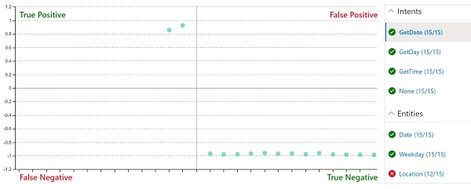

---
lab:
    title: 'Create a Language Understanding App'
    module: 'Module 5 - Creating Language Understanding Solutions'
---

# Create a Language Understanding App

The Language Understanding service enables you to define an app that encapsulates a language model that applications can use to interpret natural language input from users,  predict the users *intent* (what they want to achieve), and identify any *entities* to which the intent should be applied.

For example, a language understanding app for a clock application might be expected to process input such as:

*What is the time in London?*

This kind of input is an example of an *utterance* (something a user might say or type), for which the desired *intent* is to get the time in a specific location (an *entity*); in this case, London.

> **Note**: The task of the language understanding app is to predict the user's intent, and identify any entities to which the intent applies. It is <u>not</u> its job to actually perform the actions required to satisfy the intent. For example, the clock application can use a language app to discern that the user wants to know the time in London; but the client application itself must then implement the logic to determine the correct time and present it to the user.

## Clone the repository for this course

If you have not already cloned **AI-102-AIEngineer** code repository to the environment where you're working on this lab, follow these steps to do so. Otherwise, open the cloned folder in Visual Studio Code.

1. Start Visual Studio Code.
2. Open the palette (SHIFT+CTRL+P) and run a **Git: Clone** command to clone the `https://github.com/MicrosoftLearning/AI-102-AIEngineer` repository to a local folder (it doesn't matter which folder).
3. When the repository has been cloned, open the folder in Visual Studio Code.
4. Wait while additional files are installed to support the C# code projects in the repo.

    > **Note**: If you are prompted to add required assets to build and debug, select **Not Now**.

## Create Language Understanding resources

To use the Language Understanding service, you need two kinds of resource:

- An *authoring* resource: used to define, train, and test the language understanding app. This must be a **Language Understanding - Authoring** resource in your Azure subscription.
- A *prediction* resource: used to publish your language understanding app and handle requests from client applications that use it. This can be either a **Language Understanding** or **Cognitive Services** resource in your Azure subscription.

     > **Important**: Authoring resources must be created in one of three *regions* (Europe, Australia, or US). Language Understanding apps created in European or Australian authoring resources can only be deployed to prediction resources in Europe or Australia respectively; models created in US authoring resources can be deployed to prediction resources in any Azure location other than Europe and Australia. See the [authoring and publishing regions documentation](https://docs.microsoft.com/azure/cognitive-services/luis/luis-reference-regions) for details about matching authoring and prediction locations.

If you don't already have Language Understanding authoring and prediction resources:

1. Open the Azure portal at `https://portal.azure.com`, and sign in using the Microsoft account associated with your Azure subscription.
2. Select the **&#65291;Create a resource** button, search for *language understanding*, and create a **Language Understanding** resource with the following settings.

    *Ensure you select **Language Understanding**, <u>not</u> Language Understanding (Azure Cognitive Services)*

    - **Create option**: Both
    - **Subscription**: *Your Azure subscription*
    - **Resource group**: *Choose or create a resource group (if you are using a restricted subscription, you may not have permission to create a new resource group - use the one provided)*
    - **Name**: *Enter a unique name*
    - **Authoring location**: *Select your preferred location*
    - **Authoring pricing tier**: F0
    - **Prediction location**: *The same as your authoring location*
    - **Prediction pricing tier**: F0
3. Wait for the resources to be created, and note that two Language Understanding resources are provisioned; one for authoring, and another for prediction. You can view both of these by navigating to the resource group where you created them. If you select **Go to resource**, it will open the *authoring* resource.

## Create a Language Understanding app

Now that you have created an authoring resource, you can use it to create a Language Understanding app.

1. In a new browser tab, open the Language Understanding portal at `https://www.luis.ai`.
2. Sign in using the Microsoft account associated with your Azure subscription. If this is the first time you have signed into the Language Understanding portal, you may need to grant the app some permissions to access your account details. Then complete the *Welcome* steps by selecting your Azure subscription and the authoring resource you just created.

    > **Note**: If your account is associated with multiple subscriptions in different directories, you may need to switch to the directory containing the subscription where you provisioned your Language Understanding resources.

3. On the **Conversation Apps** page, ensure your subscription and Language Understanding authoring resource are selected. Then create a new app for conversation with the following settings:
    - **Name**: Clock
    - **Culture**: English (*if this option is not available, leave it blank*)
    - **Description**: Natural language clock
    - **Prediction resource**: *Your Language Understanding prediction resource*

    If your **Clock** app isn't opened automatically, open it.
    
    If a panel with tips for creating an effective Language Understanding app is displayed, close it.

## Create intents

The first thing we'll do in the new app is to define some intents.

1. On the **Intents** page, select **&#65291; Create** to create a new intent named **GetTime**.
2. In the **GetTime** intent, add the following utterances as example user input:

    *what is the time?*

    *what time is it?*

3. After you've added these utterances, go back to the **Intents** page and add another new intent named **GetDay** with the following utterances:

    *what is the day today?*

    *what day is it?*

4. After you've added these utterances, go back to the **Intents** page and add another new intent named **GetDate** with the following utterances:

    *what is the date today?*

    *what date is it?*

5. After you've added these utterances, go back to the **Intents** page and select the **None** intent. This is provided as a fallback for input that doesn't map to any of the intents you have defined in your language model.
6. Add the following utterances to the **None** intent:

    *hello*

    *goodbye*

## Train and test the app

Now that you've added some intents, let's train the app and see if it can correctly predict them from user input.

1. At the top right of the portal, select **Train** to train the app.
2. When the app is trained, select **Test** to display the Test panel, and then enter the following test utterance:

    *what's the time now?*

    Review the result that is returned, noting that it includes the predicted intent (which should be **GetTime**) and a confidence score that indicates the probability the model calculated for the predicted intent.

3. Try the following test utterance:

    *tell me the time*

    Again, review the predicted intent and confidence score.

4. Try the following test utterance:

    *what's today?*

    Hopefully the model predicts the **GetDay** intent.

5. Finally, try this test utterance:

    *hi*

    This should return the **None** intent.

6. Close the Test panel.

## Add entities

So far you've defined some simple utterances that map to intents. Most real applications include more complex utterances from which specific data entities must be extracted to get more context for the intent.

### Add a *machine learned* entity

The most common kind of entity is a *machine learned* entity, in which the app learns to identify entity values based on examples.

1. On the **Entities** page, select **&#65291; Create** to create a new entity.
2. In the **Create an entity** dialog box, create a **Machine learned** entity named **Location**.
3. After the **Location** entity has been created, return to the **Intents** page and select the **GetTime** intent.
4. Enter the following new example utterance:

    *what time is it in London?*

5. When the utterance has been added, select the word ***london***, and in the drop-down list that appears, select **Location** to indicate that "london" is an example of a location.
6. Add another example utterance:

    *what is the current time in New York?*

7. When the utterance has been added, select the words ***new york***, and map them to the **Location** entity.

### Add a *list* entity

In some cases, valid values for an entity can be restricted to a list of specific terms and synonyms; which can help the app identify instances of the entity in utterances.

1. On the **Entities** page, select **&#65291; Create** to create a new entity.
2. In the **Create an entity** dialog box, create a **List** entity named **Weekday**.
3. Add the following **Normalized values** and **synonyms**:

    | Normalized values | synonyms|
    |-------------------|---------|
    | sunday | sun |
    | monday | mon |
    | tuesday | tue |
    | wednesday | wed |
    | thursday | thu |
    | friday | fri |
    | saturday | sat |

3. After the **Weekday** entity has been created, return to the **Intents** page and select the **GetDate** intent.
4. Enter the following new example utterance:

    *what date was it on Saturday?*

5. When the utterance has been added, verify that **saturday** has been automatically mapped to the **Weekday** entity. If not, select the word ***saturday***, and in the drop-down list that appears, select **Weekday**.
6. Add another example utterance:

    *what date will it be on Friday?*

7. When the utterance has been added, ensure **friday** is mapped to the **Weekday** entity.

### Add a *Regex* entity

Sometimes, entities have a specific format, such as a serial number, form code, or date. You can define a regular expression (*regex*) that describes an expected format to help your app identify matching entity values.

1. On the **Entities** page, select **&#65291; Create** to create a new entity.
2. In the **Create an entity** dialog box, create a **Regex** entity named **Date** with the following regex:

    ```
    [0-9]{2}/[0-9]{2}/[0-9]{4}
    ```

    > **Note**: This is a simple regex that checks for two digits followed by a "/", another two digits, another "/", and four digits - for example *01/11/2020*. It allows for invalid dates, such as *56/00/9999*; but it's important to remember that the entity regex is used to identify data entry that is *intended* as a date - not to validate date values.

3. After the **Date** entity has been created, return to the **Intents** page and select the **GetDay** intent.
4. Enter the following new example utterance:

    *what day was 01/01/1901?*

5. When the utterance has been added, verify that **01/01/1901** has been automatically mapped to the **Date** entity. If not, select ***01/01/1901***, and in the drop-down list that appears, select **Date**.
6. Add another example utterance:

    *what day will it be on 12/12/2099?*

7. When the utterance has been added, ensure **12/12/2099** is mapped to the **Date** entity.

### Retrain the app

Now that you've modified ths language model, you need to retrain and retest the app.

1. At the top right of the portal, select **Train** to retrain the app.
2. When the app is trained, select **Test** to display the Test panel, and then enter the following test utterance:

    *what's the time in Edinburgh?*

3. Review the result that is returned, which should hopefully predict the **GetTime** intent. Then select **Inspect** and in the additional inspection panel that is displayed, examine the **ML entities** section. The model should have predicted that "edinburgh" is an instance of a **Location** entity.
4. Try testing the following utterances:

    *what date is it on Friday?*

    *what's the date on Thu?*

    *what was the day on 01/01/2020?*

5. When you have finished testing, close the inspection panel, but leave the test panel open.

## Perform batch testing

You can use the test pane to test individual utterances interactively, but for more complex language models it is generally more efficient to perform *batch testing*.

1. In Visual Studio Code, open the **batch-test.json** file in the **09-luis-app** folder. This file consists of a JSON document that contains multiple test cases for the clock language model you created.
2. In the Language Understanding portal, in the Test panel, select **Batch testing panel**. Then select **&#65291; Import** and import the **batch-test.json** file, assigning the name **clock-test**.
3. In the Batch testing panel, run the **clock-test** test.
4. When the test has completed, select **See results**.
5. On the results page, view the confusion matrix that represents the prediction results. It shows true positive, false positive, true negative, and false negative predictions for the intent or entity that is selected in the list on the right.

    

    > **Note**: Each utterance is scored as *positive* or *negative* for each intent - so for example "what time is it?" should be scored as *positive* for the **GetTime** intent, and *negative* for the **GetDate** intent. The points on the confusion matrix show which utterances were predicted correctly (*true*) and incorrectly (*false*) as *positive* and *negative* for the selected intent.

6. With the **GetDate** intent selected, select any of the points on the confusion matrix to see the details of the prediction - including the utterance and the confidence score for the prediction. Then select the **GetDay**, **GetTime** and **None** intents and view their prediction results. The app should have done well at predicting the intents correctly.

    > **Note**: The user interface may not clear previously selected points.

7. Select the **Location** entity and view the prediction results in the confusion matrix. In particular, note the predictions that were *false negatives* - these were cases where the app failed to detect the specified location in the utterance, indicating that you may need to add more sample utterances to the intents and retrain the model.
8. Close the Batch testing panel.

## Publish the app

In a real project, you'd iteratively refine intents and entities, retrain, and retest until you are satisfied with the predictive performance. Then, you can publish the app for client applications to use.

1. At the top right of the Language Understanding portal, select **Publish**.
2. Select **Production slot**, and publish the app.
3. After publishing is complete, at the top of the Language Understanding portal, select **Manage**.
4. On the **Settings** page, note the **App ID**. Client applications need this to use your app.
5. On the **Azure Resources** page, note the **Primary Key**, **Secondary Key**, and **Endpoint URL** for the prediction resource through which the app can be consumed. Client applications need the endpoint and one of the keys to connect to the prediction resource and be authenticated.
6. In Visual Studio Code, in the **09-luis-app** folder, select the **GetIntent.cmd** batch file and view the code it contains. This command-line script uses cURL to call the Language Understanding REST API for the specified application and prediction endpoint.
7. Replace the placeholder values in the script with the **App ID**, **Endpoint URL**, and either the **Primary Key** or **Secondary Key** for your Language Understanding app; and then save the updated file.
8. Right-click the **09-luis-app** folder and open an integrated terminal. Then enter the following command (be sure to include the quotation marks!):

    ```
    GetIntent "What's the time?"
    ```

9. Review the JSON response returned by your app, which should indicate the top scoring intent predicted for your input (which should be **GetTime**).
10. Try the following command:

    ```
    GetIntent "What's today's date?"
    ```

11. Examine the response and verify that it predicts the **GetDate** intent.
12. Try the following command:

    ```
    GetIntent "What time is it in Sydney?"
    ```

13. Examine the response and verify that it includes a **Location** entity.

14. Try the following commands and examine the responses:

    ```
    GetIntent "What time is it in Glasgow?"
    ```

    ```
    GetIntent "What's the time in Nairobi?"
    ```

    ```
    GetIntent "What's the UK time?"
    ```
15. Try a few more variations - the goal is to generate at least some responses that correctly predict the **GetTime** intent, but fail to detect a **Location** entity.

    Keep the terminal open. You will return to it later.

## Apply *active learning*

You can improve a Language Understanding app based on historical utterances submitted to the endpoint. This practice is called *active learning*.

In the previous procedure, you used cURL to submit requests to your app's endpoint. These requests included the option to log the queries, which enables the app to track them for use in active learning.

1. In the Language Understanding portal, Select **Build** and view the **Review endpoint utterances** page. This page lists logged utterances that the service has flagged for review.
2. For any utterances for which the intent and a new location entity (that wasn't included in the original training utterances) are correctly predicted, select **&#10003;** to confirm the entity, and then use the **&#10514;** icon to add the utterance to the intent as a training example.
3. Find an example of an utterance in which the **GetTime** intent was correctly identified, but a **Location** entity was <u>not</u> identified; and select the location name and map it to the **location** entity. Then use the **&#10514;** icon to add the utterance to the intent as a training example.
4. Go to the **Intents** page and open the **GetTime** intent to confirm that the suggested utterances have been added.
5. At the top of the Language Understanding portal, select **Train** to retrain the app.
6. At the top right of the Language Understanding portal, select **Publish** and republish the app to the **Production slot**.
7. Return to the terminal for the **09-luis-app** folder, and use the **GetIntent** command to submit the utterance you added and corrected during active learning.
8. Verify that the result now includes the **Location** entity. Then try another utterance that uses the same phrasing but specifies a different location (for example, *Berlin*).

## Export the app

You can use the Language Understanding portal to develop and test your language app, but in a software development process for DevOps, you should maintain a source controlled definition of the app that can be included in continuous integration and delivery (CI/CD) pipelines. While you *can* use the Language Understanding SDK or REST API in code scripts to create and train the app, a simpler way is to use the portal to create the app, and export it as a *.lu* file that can be imported and retrained in another Language Understanding instance. This approach enables you to make use of the productivity benefits of the portal while maintaining portability and reproducibility for the app.

1. In the Language Understanding portal, select **Manage**.
2. On the **Versions** page, select the current version of the app (there should only be one).
3. In the **Export** drop-down list, select **Export as LU**. Then, when prompted by your browser, save the file in the **09-luis-app** folder.
4. In Visual Studio Code, open the **.lu** file you just exported and downloaded (if you are prompted to search the marketplace for an extension that can read it, dismiss the prompt). Note that the LU format is human-readable, making it an effective way to document the definition of your Language Understanding app in a team development environment.

## More information

For more information about using the **Language Understanding** service, see the [Language Understanding documentation](https://docs.microsoft.com/azure/cognitive-services/luis/).
