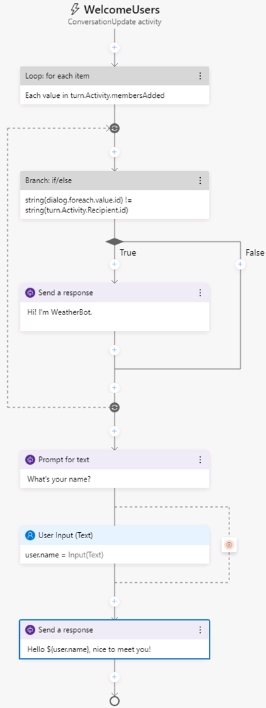
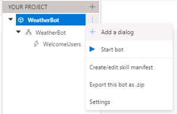
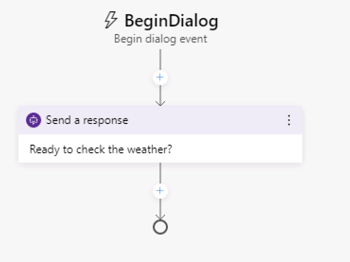
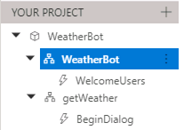
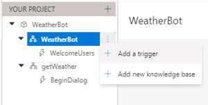
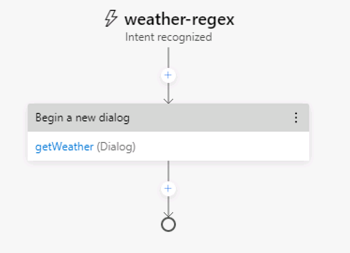
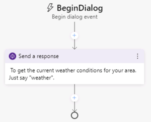
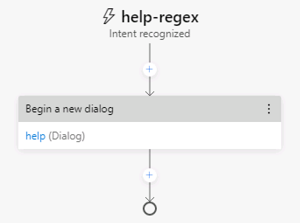
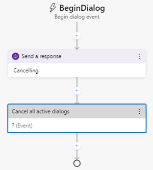

---
lab:
    title: 'Create a Bot with Bot Framework Composer'
---

# Create a Bot with Bot Framework Composer

Bot Framework Composer is a visual designer that lets you quickly and easily build sophisticated conversational bots without writing code. The composer is an open-source tool that presents a visual canvas for building bots. It uses the latest SDK features so you can build sophisticated bots with relative ease.

## Get an OpenWeather API key

In this exercise, you will create a bot that retrieves the weather conditions for the zipcode entered by the user. You will require an API key for the service to work so visit the [OpenWeather site*](https://openweathermap.org/price) to create a user account and get a free API key before you start.

## Clone the repository for this course

If you have not already done so, you must clone the code repository for this course:

1. Start Visual Studio Code.
2. Open the palette (SHIFT+CTRL+P) and run a **Git: Clone** command to clone the **https://github.com/MicrosoftLearning/AI-102-AIEngineer** repository to a local folder.
3. When the repository has been cloned, open the folder in Visual Studio Code.
4. Wait while additional files are installed to support the C# code projects in the repo.

## Create a basic bot

Now you're ready to use Composer to create a bot.

### Create a bot and customize the "welcome" dialog flow

1. Start the Bot Framework Composer.
1. On the **Home** screen, select **New**. Then create a new bot from scratch; naming it **WeatherBot** and saving it in a local folder.

    Close the **Welcome** dialog box and leave the tour if prompted.

1. In the navigation pane on the left, select **Greeting** to open the authoring canvas and show the ConversationUpdate activity that is called when a user initially joins a conversation with the bot. The activity consists of a flow of actions.
1. In the properties pane on the right, edit the title of **Greeting** by selecting the word **Greeting** at the top of the properties pane on the right and changing it to **WelcomeUsers**.
1. In the authoring canvas, select the **Send a response** action. Then, in the properties pane, change the default text in the **Language Generation** box from *- ${WelcomeUser()}*  to **- Hi! I'm WeatherBot.** (including the preceding "-" dash).
1. In the authoring canvas, select the final **+** symbol just above the circle at the end of the dialog flow, and add a new **Ask a question** action for a **Text** response.

    The new action creates two nodes in the dialog flow. The first node defines a prompt for the bot to ask the user a question, and the second node represents the response that will be received from the user. In the properties pane, these nodes have corresponding **Bot asks** and **User input** tabs.

1. In the properties pane, on the **Bot Asks** tab, set the **Prompt for text** value to **- What's your name?**. Then, on the **User Input** tab, set the **Property** value to **user&period;name** to define a variable that you can access later in the bot conversation.
1. Back in the authoring canvas, select the **+** symbol under the **User Input(Text)** action you just added, and add a **Send a response** action.
1. Select the newly added **Send a response** action and in the properties pane, set the **Language generation** value to **- Hello ${user&period;name}, nice to meet you!**.

    The completed activity flow should look like this:

    

### Test the bot

Your basic bot is complete so now let's test it.

1. Select **Start Bot** in the upper right-hand corner of Composer, and wait a minute or so while your bot is compiled and started. After a few minutes, a **Test in Emulator** option is available next to the button.

    * If a Windows Firewall message is displayed, enable access for all networks.

1. In the Bot Framework Composer, select **Test in Emulator**. Then wait for the Bot Framework Emulator to start.

    *If the emulator doesn't start, and you are prompted to search the Windows store for an app, copy the URL for your bot in the **Local bot runtime manager** pane. Then start the Bot Framework Emulator manually and open your bot using the URL.*

1. In the Bot Framework Emulator, after a short pause, you will see the welcome message and the prompt to enter your first name.  Enter you first name and press **Enter**.
1. The bot should respond with the **Hello *your_first_name*, nice to meet you!**.
1. Close the emulator.
1. In Composer, in the **Local bot runtime manager** pane. use the ⏹ icon to stop the bot.

## Add a dialog to get the weather

Now that you have a working bot, you can expand its capabilities by adding dialogs for specific interactions. In this case, you'll add a dialog that is triggered when the user mentions "weather".

### Add a dialog

First, you need to define a dialog flow that will be used to handle questions about the weather.

1. In Composer, in the navigation pane, hold the mouse over the top level node (**WeatherBot**) and in the **&#8285;** menu, select **+ Add a dialog**, as shown here:

    

    Then create a new dialog named **getWeather** with the description **Get the current weather condition for the provide zip code**.
1. In the navigation pane, select the **BeginDialog** node for the new **getWeather** dialog. Then on the authoring canvas, use the **+** symbol to add a **Send a response** action.
1. In the properties panel for the new action, in the **Language Generation** area, enter **- Ready to check the weather?**.

The **getWeather** activity flow should look like this:



### Add a trigger for the dialog

Now you need some way for the new dialog to be initiated from the existing welcome dialog.

1. In the navigation pane, select the **WeatherBot** workflow that contains the **WelcomeUsers** dialog (this is under the top-level bot node of the same name).

    

1. In the properties pane for the selected **WeatherBot** workflow, in the **Language Understanding** section, set the **Recognizer type** to **Regular expression recognizer**.

1. In the **&#8285;** menu for the **WeatherBot** workflow, select **Add a Trigger**.

    

    Then create a trigger with the following settings:

    - Select **Intent recognized** from the **What is the type of this trigger?** drop-down list.
    - Enter **weather-regex** for the **What is the name of this trigger (RegEx)** value.
    - Enter **weather** for the **Please input regex pattern** value.

    > The text entered in the regex pattern text box is a simply regular expression pattern that will cause the bot to look for the word *weather* in any incoming message.  If weather is present, the message becomes a **recognized intent**.

1. Now that the trigger is created, you need to configure an action for it. In the authoring canvas for the trigger, elect the **+** symbol under your new **weather-regex** trigger node. Then in the list of actions, select **Dialog Management** and select **Begin a new dialog**.
1. With the **Begin a new dialog** action selected, in the properties pane, select the **getWeather** dialog from the **Dialog name** drop-down list to start the **getWeather** dialog you defined earlier when the **weather-regex** trigger is recognized.

    The **weather-regex** activity flow should look like this:

    

1. Restart the bot and use the Bot emulator to test your progress so far. After entering your name and being welcomed, enter a phrase containing "weather" (for example *What's the weather forecast?*), and your bot should respond with, **Ready to check the weather?**.
1. When you have finished testing, close the emulator, and stop the bot.

### Implement the weather dialog

The **getWeather** dialog flow so far consists of a simple message. Now you need to add actions to get the user's zipcode and retrieve the relevant weather information.

1. In the navigation pane, select the **BeginDialog** trigger under the **getWeather** dialog. 
1. Directly under the **Send a response** action you added previously, add a new **Ask a question** action for a **Text** response.
1. In the properties pane, on the **Bot asks** tab, set the **Prompt for text** to **- Enter your zipcode.**.
1. On the **User Input** tab, set the **Property** field to **user.zipcode**, and set the **Output format** field to the expression **=trim(this.value)** to remove any superfluous spaces around the user-provided value.
1. On the **Other** tab, set the following values to define validation rules for the zipcode input:
    - In the **Recognizers** areas, set the **Unrecognized Prompt** field, to **- Sorry the value '${this.value}' doesn't appear to be a valid entry.  Please enter a zip code in the form of 12345.**.
    - In the **Validation** section, enter the validation rule **length(this.value) == 5** to will check that the length of the zipcode entry is only five characters. Then set the **Invalid Prompt** field to **- Sorry, '${this.value}' is not valid. I'm looking for a 5-digit number as zip code. Please specify a zip code in the form 12345.**.
    - In the **Prompt configurations** section, set the **Default value** property to **98052**.

        By default, prompts are configured to ask the user for information *Max turn count* times (with a default of 3). When the max turn count is reached, the prompt will stop and the property will be set to the value defined in the **Default value** field before moving forward with the conversation.

    The activity flow so far should look like this:

    

1. On the authoring canvas, directly under the **user Input** action for the user zipcode entry, select the **+** symbol to add a new action.
1. From the list of actions, select **Access external resources** and then **Send an HTTP request**.
1. Set the properties for the **HTTP request** as follows, specifying your [OpenWeather](https://openweathermap.org/price) API key:
    - **HTTP method**: GET
    - **Url**: http://weatherbot-ignite-2019.azurewebsites.net/api/getWeather?zipcode=${user.zipcode}&api_token=*Your_API_Key*
    - **Result property**: dialog.api_response

    The result can include any of the following four properties from the HTTP response:

    - **statusCode**. Accessed via **dialog.api_response.statusCode**.
    - **reasonPhrase**. Accessed via **dialog.api_response.reasonPhrase**.
    - **content**. Accessed via **dialog.api_response**.content.
    - **headers**. Accessed via **dialog.api_response.headers**.

    Additionally, if the response type is JSON, it will be a deserialized object available via **dialog.api_response.content** property.

    Now you need to add logic to the dialog flow that handles the response, which might indicate success or failure of the HTTP request. 

1. On the authoring canvas, under the **Send HTTP Request** action on the you created, add a **Create a condition** > **Branch: if/else** action. This action defines a branch in the dialog flow with **True** and **False** paths.
1. In the **Properties** of the branch action, set the **Condition** field to write the following expression:

    ```code
    =dialog.api_response.statusCode == 200
    ```

1. If the call was successful, you need to store the response in a variable. On the authoring canvas, in the **True** branch, add a **Manage properties** > **Set a Property** action. Then in the properties pane, set the properties of the **Set a Property** action as follows:
    - **Property**: dialog.weather
    - **Value**: =dialog.api_response.content

1. Still in the **True** branch, add a **Send a response** action under the **Set a property** action and set its **Language generation** text to **- The weather in ${dialog.weather.city} is ${dialog.weather.weather} and the temp is ${dialog.weather.temp}\&deg;.**
1. You also need to account for a response from the weather service that is not 200, so in the **False** branch, add a **Send a response** action and set its **Language generation** text to **- I got an error: ${dialog.api_response.content.message}.**

    For the purposes of this exercise, we will assume that an invalid zip code is the most likely cause of a failure, and if it is invalid it should be removed.

1. In the **False** branch, after the  **Send a response** action you just created, add a **Manage properties** > **Delete a property** action and set its **Property** field to **user.zipcode**.

    The finished activity flow should look like the following image:

    

1. Restart the bot and test it in the Bot Framework Emulator. Wait for the greeting from the bot and after enterining your name, enter "What is the weather like?". Then, when prompted, enter a valid U.S. zip code, such as 98004. The bot will contact the service and should respond with a small weather report statement.
1. When you have finished testing, close the emulator and stop the bot.

## Add *help* functionality

Users may need help to understand how your bot works. You can add help to your bot using a dialog, and enable users to interrupt a dialog to ask for help.

1. In the navigation pane, add a new dialog named **help** to the top-level **WeatherBot** bot node. Then select the new **help** dialog's **BeginDialog** trigger to see it in the *authoring canvas.
1. Add a **Send a response** action, and set its **Language Generation** text to **- To get the current weather conditions for your area. Just say "weather".**.

    The completed activity flow should look like this:

    

    To ensure that help is available when a user enters the word **help**, you need to add an **Intent Recognized trigger**. This trigger will be placed in your main dialog.

1. In the navigation pane, select the **WeatherBot** dialog (under the **WeatherBot** bot), and in the properties pane, in the **Language Understanding** section, verify that the **Recognizer type** is set to **Regular expression recognizer**.
1. Add a new trigger to the **WeatherBot** dialog, with the following settings:
    - **What is the type of this trigger?**: Intent recognized
    - **What is the name of this trigger (RegEx)**:  help-regex
    - **Please input regex pattern**: help
1. In the authoring canvas for the new trigger, select the **+** symbol under your new **help** trigger node. Then in the list of actions, select **Dialog Management** > **Begin a new dialog**.
1. To specify the dialog to call when the help intent is recognized, select **help** in the **Dialog name** drop-down list in the properties pane.

    The **help-regex** trigger dialog flow should look like this:

    

1. In the navigation pane, under the **WeatherBot** dialog, select **WelcomeUsers** to open it in the authoring canvas.
1. Select the **Prompt for text** action where the user is asked for their name, and in the properties pane, on the **Other** tab, in the **Prompt configurations** section, set the **Allow interruptions** property to **true**.
1. Restart your bot and test in the emulator.
1. When asked for your name, enter "help" and review the response.
1. When you've finished testing, close the emulator and stop the bot.

## Use Language Generation

The Bot Framework Composer integrates with the Bot Framework Language Generation (LG) library. The library is a set of powerful templating and message formatting tools that let you include variation, conditional messages, and dynamic content. LG gives you greater control of how your bot responds to the user.

### Add multiple greetings

Currently, your weather bot has only one phrase to greet users with. To add some variety in the greetings, you can add multiple phrases with different wording in each, and the bot will randomly choose one of the phrases when a new conversation is started.

1. In the navigation pane, select the **WelcomeUsers** trigger under the **WeatherBot** dialog.
2. Select the **Send a response** action that currently sends the message *Hi! I'm WeatherBot.*.
3. In the properties pane, modify the contents of the **Language Generation** text area to include the following phrases:

    ```code
    - Hello. I'm WeatherBot. Enter "weather" to start.
    - Hi! I am WeatherBot and can retrieve weather conditions for you. Try saying "weather".
    - Need to know the weather conditions? Say "weather" and I can help.
    ```
### Create a template

All of your bot responses are based on templates, which you can create and manage.

1. Expand the &#9776; menu pane on the left, and select the **Bot Responses** page.
2. Select the **getWeather** entry to view the response templates that have been defined for this dialog.
3. Select **Show code** to enable edit mode. Each template is shown as a template name that begins with **#**, containing one or more responses, each beginning with a **-**.

4. To create a template for weather condition responses, add the following code at the end of the current list of templates.

```code
# DescribeWeather(weather)
- IF: ${weather.weather=="Clouds"}
    - It is cloudy
- ELSEIF: ${weather.weather=="Thunderstorm"}
    - There's a thunderstorm
- ELSEIF: ${weather.weather=="Drizzle"}
    - It is drizzling
- ELSEIF: ${weather.weather=="Rain"}
    - It is raining
- ELSEIF: ${weather.weather=="Snow"}
    - There's snow
- ELSEIF: ${weather.weather=="Clear"}
    - The sky is clear
- ELSEIF: ${weather.weather=="Mist"}
    - There's a mist in the air
- ELSEIF: ${weather.weather=="Smoke"}
    - There's smoke in the air
- ELSEIF: ${weather.weather=="Haze"}
    - There's a haze
- ELSEIF: ${weather.weather=="Dust"}
    - There's a dust in the air
- ELSEIF: ${weather.weather=="Fog"}
    - It's foggy
- ELSEIF: ${weather.weather=="Ash"}
    - There's ash in the air
- ELSEIF: ${weather.weather=="Squall"}
    - There's a squall
- ELSEIF: ${weather.weather=="Tornado"}
    - There's a tornado happening
- ELSE:
    - ${weather.weather}
```

The template contains an IF/ELSEIF/ELSE structure and is known as a Language Generation Template. When the weather data is returned from the service, the Language Generation system will evaluate the weather.weather variable, match it to one of the clauses in the IF structure, and generate a more user-friendly response that will be displayed to the user. For the template to function, you will need to modify the design of the **getWeather** dialog.

### Use the template in a response

1. Return to the **Design** page.
2. In the navigation pane, select **BeginDialog** under the **getWeather** dialog.
3. In the **true/false** flow that you created previously, select the **Send a response** action in the **true** path.  It will start with the text. *The weather in ${dialog.weather.city} is...*.
4. Replace the current text in the **Language Generation** text area with **- ${DescribeWeather(dialog.weather)} in ${dialog.weather.city}. The temperature is ${dialog.weather.temp}\&deg;.**

    This response uses the **DescribeWeather** template that you created, nested inside another template. LG templates can be combined in this way to create more complex templates. For more information on language generation templates, see the [language generation concept web page](https://docs.microsoft.com/composer/concept-language-generation).

5. Test your changes by restarting the bot and testing it with the emulator. The welcome message should be one of the phrases you specified, and the response with the weather conditions should be based on the language generation template you defined.
6. When you have finished testing, close the emulator and stop the bot.

## Use buttons and cards

The interactions with the weather bot so far has been through text.  Users enter text for their intentions and the bot responds with text. While text is often a suitable way to communicate, you can enhance the experience through the use of other interaction methods such as buttons or cards.  Buttons present options for the user to select from, helping direct the conversation. Cards present a more visually appealing interaction for users as well.

## Add buttons

1. In the navigation pane, under the **getWeather** action, select **BeginDialog**.
2. In the authoring canvas, select the **Prompt for text** action that contains the prompt for the zipcode.
3. In the properties pane, update **Prompt for text** with the following value (Ensure that you remove the **-** dash along with the existing text).

    ```json
    [Activity
        Text = What is your zip code?
        SuggestedActions = help | cancel
    ]
    ```

## Add a card

1. In the **True** path after checking the response from the HTTP weather service, edit the **Send a response** action for the weather report and the existing template with this text.

```json
[ThumbnailCard
    title = Weather for ${dialog.weather.city}
    text = ${DescribeWeather(dialog.weather)}. The temperature is ${dialog.weather.temp}&deg;.
    image = ${dialog.weather.icon}
]
```

This template will use the same variables as before for the weather condition but also adds a title to the card that will be displayed, along with an image for the weather condition.

2. Restart the bot and test it with the Bot Framework Emulator.
3. Enter "weather" and review the user interface for entering your zipcode. Then, when you enter the zipcode, review the card that is displayed in the response.
4. When you have finished testing, close the emulator and stop the bot.

    For more information on using adaptive cards, see the [adaptive cards](https://docs.microsoft.com/adaptive-cards/getting-started/bots) topic.

## Add Language Understanding

Your bot currently relies on detecting regular expressions that identify specific words like "weather" and "help". It could be improved by the ability to understand more complex natural language input. Microsoft Azure Cognitive Services offers a robust language understanding capability in the form of the Language Understanding technology. The Bot Framework Composer offers the Language Understanding recognizer as a means to access the Language Understanding technology.

The use of the Language Understanding recognizer requires a bit more work than the regular expressions you have been using. You will need to have a Language Understanding service Azure resource with an authoring key, and you will need to provide some sample utterances to train a model to recognize the user's intent in the messages they submit.

### Add a Language Understanding trigger for a *cancel* dialog

 At any point in a bot conversation, the user may decide to cancel the interaction. In this exercise, you will implement a cancel action that can be triggered using natural language phrases.

1. In the navigation pane, under the **getWeather** dialog, select **BeginDialog** to open it in the authoring canvas.
1. Select the **Prompt for text** action where the user is asked for their zipcode, and in the properties pane, on the **Other** tab, in the **Prompt configurations** section, set the **Allow interruptions** property to **true**.
1. In the navigation pane, add a new dialog named **cancel** to the top-level **WeatherBot** bot.
1. In the navigation pane, under the new **cancel** dialog, select **BeginDialog** to open it in the authoring canvas.
1. Add a **Send a response** action, and set its **Language Generation** text to **- Canceling.**.
1. After the **Send a response** action, add a new **Dialog Management** > **Cancel all active dialogs**. When this action is initiated, it will cancel any active and all active dialogs and send the user back to the main dialog.

    The **cancel** activity flow should look like this:

    

    Now you need to define an intent recognizer trigger to recognize the cancel request.

1. In the navigation pane, select the **getWeather** dialog, and in its properties pane, verify that under **Language Understanding**, the **Recognizer type** is set to **Default recognizer** - this recognizer type uses the Language Understanding service, rather than the regular expression recognizer you used previously.
1. In the navigation pane, add a new trigger to the **getWeather** dialog, with the following settings:
    - **What is the type of this trigger?**: Intent recognized
    - **What is the name of this trigger (LUIS)**:  cancel-lu
    - **Trigger phrases**:

        *- cancel*

        *- quit*

        *- stop*

1. In the **cancel-lu** trigger flow, add a **Dialog management** > **Begin a new dialog** action Then, in the properties pane for the **Begin a new dialog** action, select the **cancel** trigger from the **Dialog name** drop-down.

    You may see a warning icon for your bot. By using the Language Understanding recognizer, you have added a dependency on a Language Understanding Azure resource.

### Create a Language Understanding resource in Azure

You require a Language Understanding resource before you can publish your phrases for training.

If you don't already have Language Understanding authoring and prediction resources in your Azure subscription, follow these steps to create them:

1. Open the Azure portal at [https://portal.azure.com](https://portal.azure.com?portal=true), and sign in using the Microsoft account associated with your Azure subscription.
2. Select the **&#65291;Create a resource** button, search for *language understanding*, and create a **Language Understanding** resource with the following settings:
    - **Create option**: Both
    - **Subscription**: *Your Azure subscription*
    - **Resource group**: *Choose or create a resource group (if you are using a restricted subscription, you may not have permission to create a new resource group - use the one provided)*
    - **Name**: *Enter a unique name*
    - **Authoring location**: *Select your preferred location*
    - **Authoring pricing tier**: F0
    - **Prediction location**: *Choose the <u>same location</u> as your authoring location*
    - **Prediction pricing tier**: F0\*

    \**If F0 is not available, choose S0*

3. Wait for the resources to be created, and note that two Language Understanding resources are provisioned; one for authoring, and another for prediction. You can view both of these by navigating to the resource group where you created them.
4. After the deployment has finished, go the resource page for the **authoring** resource and view the **Keys and Endpoint** page. Then copy one of the keys to the clipboard.
5. Back in the Bot Framework Composer, in the **&#8285;** menu for the top-level **WeatherBot** bot, select **Settings**.
6. Paste your Language Understanding authoring key into the **LUIS authoring key** property.
7. Return to the **Design** page.

### Test the natural language *cancel* functionality

1. Restart your bot and test in the emulator.
1. Enter your name, and then *what's the weather?*
1. When prompted for a zipcode, enter *I want to stop* and the bot should respond with the message **Canceling.**
1. When you have finished testing, close the emulator and composer.
