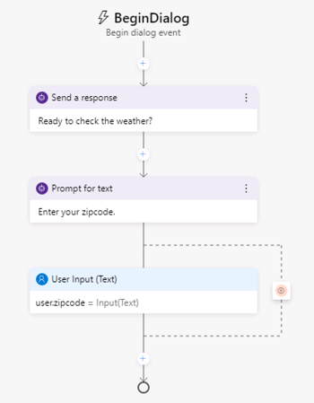

---
lab:
    title: 'Create a Bot with Bot Framework Composer'
    module: 'Module 7 - Conversational AI and the Azure Bot Service'
---

# Create a Bot with Bot Framework Composer

Bot Framework Composer is a graphical designer that lets you quickly and easily build sophisticated conversational bots without writing code. The composer is an open-source tool that presents a visual canvas for building bots.

## Prepare to develop a bot

Let's start by preparing the services and tools you need to develop a bot.

### Get an OpenWeather API key

In this exercise, you will create a bot that uses the OpenWeather service to retrieve weather conditions for the city entered by the user. You will require an API key for the service to work.

1. In a web browser, go to the OpenWeather site at `https://openweathermap.org/price`.
2. Request a free API key, and create an OpenWeather account (if you do not already have one).
3. After signing up, view the **API keys** page to see your API key.

### Update Bot Framework Composer

You're going to use the Bot Framework Composer to create your bot. This tools is updated regularly, so let's make sure you have the latest version installed.

> **Note**: Updates may include changes to the user interface that affect the instructions in this exercise.

1. Start the **Bot Framework Composer**, and if you are not automatically prompted to install an update, use the **Check for updates** option on the **Help** menu to check for updates.
2. If an update is available, choose the option to install it when the application is closed. Then close the Bot Framework Composer and install the update for the currently logged in user, restarting the Bot Framework Composer after the installation is complete. Installation may take a few minutes.
3. Ensure that the version of Bot Framework Composer is **2.0.0** or later.

## Create a bot

Now you're ready to use the Bot Framework Composer to create a bot.

### Create a bot and customize the "welcome" dialog flow

1. Start the Bot Framework Composer if it's not already open.
2. On the **Home** screen, select **New**. Then create a new empty bot; naming it **WeatherBot** and saving it in a local folder.
3. Close the **Get Started** pane if it opens, and then in the navigation pane on the left, select **Greeting** to open the authoring canvas and show the *ConversationUpdate* activity that is called when a user initially joins a conversation with the bot. The activity consists of a flow of actions.
4. In the properties pane on the right, edit the title of **Greeting** by selecting the word **Greeting** at the top of the properties pane on the right and changing it to **WelcomeUsers**.
5. In the authoring canvas, select the **Send a response** action. Then, in the properties pane, change the default text from *Hi to your bot*  to `Hi! I'm WeatherBot.`
6. In the authoring canvas, select the final **+** symbol (just above the circle that marks the <u>end</u> of the dialog flow), and add a new **Ask a question** action for a **Text** response.

    The new action creates two nodes in the dialog flow. The first node defines a prompt for the bot to ask the user a question, and the second node represents the response that will be received from the user. In the properties pane, these nodes have corresponding **Bot response** and **User input** tabs.

7. In the properties pane, on the **Bot response** tab, add a response with the text `What's your name?`. Then, on the **User input** tab, set the **Property** value to `user.name` to define a variable that you can access later in the bot conversation.
8. Back in the authoring canvas, select the **+** symbol under the **User input(Text)** action you just added, and add a **Send a response** action.
9. Select the newly added **Send a response** action and in the properties pane, set the text value to `Hello ${user.name}, nice to meet you!`.

    The completed activity flow should look like this:

    

### Test the bot

Your basic bot is complete so now let's test it.

1. Select **Start Bot** in the upper right-hand corner of Composer, and wait while your bot is compiled and started. This may take several minutes.

    - If a Windows Firewall message is displayed, enable access for all networks.

2. In the **Local bot runtime manager** pane, select **Open Web Chat**.
3. In the **WeatherBot** web chat pane, after a short pause, you will see the welcome message and the prompt to enter your first name.  Enter you first name and press **Enter**.
4. The bot should respond with the **Hello *your_name*, nice to meet you!**.
5. Close the web chat panel.
6. At the top right of Composer, next to **&#8635; Restart bot**, click **<u>=</u>** to open the **Local bot runtime manager** pane, and use the ⏹ icon to stop the bot.

## Add a dialog to get the weather

Now that you have a working bot, you can expand its capabilities by adding dialogs for specific interactions. In this case, you'll add a dialog that is triggered when the user mentions "weather".

### Add a dialog

First, you need to define a dialog flow that will be used to handle questions about the weather.

1. In Composer, in the navigation pane, hold the mouse over the top level node (**WeatherBot**) and in the **...** menu, select **+ Add a dialog**, as shown here:

    

    Then create a new dialog named **GetWeather** with the description **Get the current weather condition for the provided zip code**.
2. In the navigation pane, select the **BeginDialog** node for the new **GetWeather** dialog. Then on the authoring canvas, use the **+** symbol to add a **Ask a question** action for a **Text** response.
3. In the properties pane, on the **Bot response** tab, add the response `Enter your city.`
4. On the **User input** tab, set the **Property** field to `dialog.city`, and set the **Output format** field to the expression `=trim(this.value)` to remove any superfluous spaces around the user-provided value.

    The activity flow so far should look like this:

    

    So far, the dialog asks the user to enter a city. Now you must implement the logic to retrieve the weather information for the city that was entered.

6. On the authoring canvas, directly under the **user Input** action for the city entry, select the **+** symbol to add a new action.
7. From the list of actions, select **Access external resources** and then **Send an HTTP request**.
8. Set the properties for the **HTTP request** as follows, replacing **YOUR_API_KEY** with your [OpenWeather](https://openweathermap.org/price) API key:
    - **HTTP method**: GET
    - **Url**: `http://api.openweathermap.org/data/2.5/weather?units=metric&q=${dialog.city}&appid=YOUR_API_KEY`
    - **Result property**: `dialog.api_response`

    The result can include any of the following four properties from the HTTP response:

    - **statusCode**. Accessed via **dialog.api_response.statusCode**.
    - **reasonPhrase**. Accessed via **dialog.api_response.reasonPhrase**.
    - **content**. Accessed via **dialog.api_response.content**.
    - **headers**. Accessed via **dialog.api_response.headers**.

    Additionally, if the response type is JSON, it will be a deserialized object available via **dialog.api_response.content** property. For detailed information about the OpenWeather API and the response it returns, see the [OpenWeather API documentation](https://openweathermap.org/current).

    Now you need to add logic to the dialog flow that handles the response, which might indicate success or failure of the HTTP request.

9. On the authoring canvas, under the **Send HTTP Request** action you created, add a **Create a condition** > **Branch: if/else** action. This action defines a branch in the dialog flow with **True** and **False** paths.
10. In the **Properties** of the branch action, set the **Condition** field to write the following expression:

    ```
    =dialog.api_response.statusCode == 200
    ```

11. If the call was successful, you need to store the response in a variable. On the authoring canvas, in the **True** branch, add a **Manage properties** > **Set properties** action. Then in the properties pane, add the following property assignments:

    | Property | Value |
    | -- | -- |
    | `dialog.weather` | `=dialog.api_response.content.weather[0].description` |
    | `dialog.temp` | `=round(dialog.api_response.content.main.temp)` |
    | `dialog.icon` | `=dialog.api_response.content.weather[0].icon` |

12. Still in the **True** branch, add a **Send a response** action under the **Set a property** action and set its text to:

    ```
    The weather in ${dialog.city} is ${dialog.weather} and the temperature is ${dialog.temp}&deg;.
    ```

    ***Note**: This message uses the **dialog.city**, **dialog.weather**, and **dialog.temp** properties you set in the previous actions. Later, you'll also use the **dialog.icon** property.*

13. You also need to account for a response from the weather service that is not 200, so in the **False** branch, add a **Send a response** action and set its text to `I got an error: ${dialog.api_response.content.message}.`

    The dialog flow should now look like this:

    

### Add a trigger for the dialog

Now you need some way for the new dialog to be initiated from the existing welcome dialog.

1. In the navigation pane, select the **WeatherBot** dialog that contains **WelcomeUsers** (this is under the top-level bot node of the same name).

    

2. In the properties pane for the selected **WeatherBot** dialog, in the **Language Understanding** section, set the **Recognizer type** to **Regular expression recognizer**.

    > The default recognizer type uses the Language Understanding service to product the user's intent using a natural language understanding model. We're using a regular expression recognizer to simplify this exercise. In a real, application, you should consider using Language Understanding to allow for more sophisticated intent recognition.

3. In the **...** menu for the **WeatherBot** dialog, select **Add new Trigger**.

    

    Then create a trigger with the following settings:

    - **What is the type of this trigger?**: Intent recognized
    - **What is the name of this trigger (RegEx)**:  `WeatherRequested`
    - **Please input regex pattern**: `weather`

    > The text entered in the regex pattern text box is a simple regular expression pattern that will cause the bot to look for the word *weather* in any incoming message.  If "weather" is present, the message becomes a **recognized intent** and the trigger is initiated.

4. Now that the trigger is created, you need to configure an action for it. In the authoring canvas for the trigger, select the **+** symbol under your new **WeatherRequested** trigger node. Then in the list of actions, select **Dialog Management** and select **Begin a new dialog**.
5. With the **Begin a new dialog** action selected, in the properties pane, select the **GetWeather** dialog from the **Dialog name** drop-down list to start the **GetWeather** dialog you defined earlier when the **WeatherRequested** trigger is recognized.

    The **WeatherRequested** activity flow should look like this:

    

6. Restart the bot and open the web chat pane.Then restart the conversation, and after entering your name, enter `What is the weather like?`. Then, when prompted, enter a city, such as `Seattle`. The bot will contact the service and should respond with a small weather report statement.
7. When you have finished testing, close the web chat pane and stop the bot.

## Handle interruptions

A well designed bot should allow users to change the flow of the conversation, for example by canceling a request.

1. In the Bot Composer, in the navigation pane, use the **...** menu for the **WeatherBot** dialog to add a new trigger (in addition to the existing **WelcomeUsers** and **WeatherRequested** triggers). The new trigger should have the following settings:

    - **What is the type of this trigger?**: Intent recognized
    - **What is the name of this trigger (RegEx)**:  `CancelRequest`
    - **Please input regex pattern**: `cancel`

    > The text entered in the regex pattern text box is a simple regular expression pattern that will cause the bot to look for the word *cancel* in any incoming message.

2. In the authoring canvas for the trigger, add a **Send a response** action, and set its text response to `OK. Whenever you're ready, you can ask me about the weather.`
3. Under the **Send a response** action, add a new action to end the dialog by selecting **Dialog management** and **End this dialog**.

    The **CancelRequest** dialog flow should look like this:

    

    Now that you have a trigger to respond to a user's request to cancel, you must allow interruptions to dialog flows where the user might want to make such a request - such as when prompted for a zip code after asking for weather information.

4. In the navigation pane, select **BeginDialog** under the **GetWeather** dialog.
5. Select the **Prompt for text** action that asks the user to enter their city.
6. In the properties for the action, on the **Other** tab, expand **Prompt Configurations** and set the **Allow Interruptions** property to **true**.
7. Restart the bot and open the web chat pane. Restart the conversation, and and after entering your name, enter `What is the weather like?`. Then, when prompted, enter `cancel`, and confirm that the request is canceled.
8. After canceling the request, enter `What's the weather like?` and note that the appropriate trigger starts a new instance of the **GetWeather** dialog, prompting you once again to enter a city.
9. When you have finished testing, close the web chat pane and stop the bot.

## Enhance the user experience

The interactions with the weather bot so far has been through text.  Users enter text for their intentions and the bot responds with text. While text is often a suitable way to communicate, you can enhance the experience through other forms of user interface element.  For example, you can use buttons to initiate recommended actions, or display a *card* to present information visually.

### Add a button

1. In the Bot Framework Composer, in the navigation pane, under the **GetWeather** action, select **BeginDialog**.
2. In the authoring canvas, select the **Prompt for text** action that contains the prompt for the city.
3. In the properties pane, select **Show code**, and replace the existing code with the following code.

```
[Activity    
    Text = ${TextInput_Prompt_Kz22lf_text()}    
    SuggestedActions = Cancel
]
```

This activity will prompt the user for their city as before, but also display a **Cancel** button.

### Add a card

1. In the **GetWeather** dialog, in the **True** path after checking the response from the HTTP weather service, select the **Send a response** action that displays the weather report.
2. In the properties pane, select **Show code** and replace the existing code with the following code.

```
[ThumbnailCard
    title = Weather for ${dialog.city}
    text = ${dialog.weather} (${dialog.temp}&deg;)
    image = http://openweathermap.org/img/w/${dialog.icon}.png
]
```

This template will use the same variables as before for the weather condition but also adds a title to the card that will be displayed, along with an image for the weather condition.

### Test the new user interface

1. Restart the bot and open the web chat pane. Restart the conversation, and after entering your name, enter `What is the weather like?`. Then, when prompted, click the **Cancel** button to cancel the request.
2. After canceling, enter `Tell me about the weather` and when prompted, enter a city, such as `London`. The bot will contact the service and should respond with a card indicating the weather conditions.
3. When you have finished testing, close the emulator and stop the bot.

## If time permits: Deploy the bot to Azure

Now you're ready to deploy your bot to Azure. Deployment involves multiple steps to prepare your bot for deployment and create the necessary Azure resources.

1. On the **Publish** screen, select 

Click publish
check the weatherbot
click "manage profiles"
click "add new"
name it "WeatherBot"
select "PUblish bot to Azure" as the publishing target
Click Next
Choose "Create new resources"
Click next
Login to Azure


### Create or select a resource group

A bot relies on multiple Azure resources, which can be created in a single resource group.

1. Open the Azure portal at `https://portal.azure.com`, and sign in using the Microsoft account associated with your Azure subscription.
2. View the **Resource Groups** page to see the resource groups that exist in your subscription.
3. Create a new resource group with a unique name in any available region. (If you are using a "sandbox" subscription that restricts you to an existing resource group, note the resource group name).

### Create an Azure application registration

Your bot needs an application registration to enable it to communicate with users and web services.

1. In the terminal window for your **TimeBot** folder, enter the following command to use the Azure command line interface (CLI) to log into Azure. When a browser opens, sign into your Azure subscription.

```
az login
```

2. If you have multiple Azure subscriptions, enter the following command to select the subscription in which you want to deploy the bot.

```
az account set --subscription "<YOUR_SUBSCRIPTION_ID>"
```

3. Enter the following command to create an application registration for **TimeBot** with the password **Super$ecretPassw0rd** (you can use an alternative display name and password if you wish, but make a note of them - you'll need them later).

```
az ad app create --display-name "TimeBot" --password 'Super$ecretPassw0rd' --available-to-other-tenants
```

4. When the command completes, a large JSON response is displayed. In this response, find the **appId** value and make a note of it. You will need it in the next procedure.

### Create Azure resources

When you use the Bot Framework SDK to create a bot from a template, the Azure Resource Manager templates necessary to create the required Azure resources are provided for you.

1. In the terminal pane for your **TimeBot** folder, enter the following command (on a single line), replacing the PLACEHOLDER values as follows:
    - **YOUR_RESOURCE_GROUP**: The name of your existing resource group.
    - **YOUR_APP_ID**: The **appId** value you noted in the previous procedure.
    - **REGION**: An Azure region code (such as *eastus*).
    - **All other placeholders**: Unique values that will be used to name the new resources. The resource IDs you specify must be globally unique strings netween 4 and 42 characters long. Make a note of the value you use for the **BotId** and **newWebAppName** parameters - you will need them later.

```
az deployment group create --resource-group "YOUR_RESOURCE_GROUP" --template-file "deploymenttemplates/template-with-preexisting-rg.json" --parameters appId="YOUR_APP_ID" appSecret="Super$ecretPassw0rd" botId="A_UNIQUE_BOT_ID" newWebAppName="A_UNIQUE_WEB_APP_NAME" newAppServicePlanName="A_UNIQUE_PLAN_NAME" appServicePlanLocation="REGION" --name "A_UNIQUE_SERVICE_NAME"
```

2. Wait for the command to complete. If it is successful, a JSON response will be displayed.

    If an error occurs, it may be caused by a typo in the command or a unique naming conflict with an existing resource. Correct the issue and try again. You may need to use the Azure portal to delete any resources that were created before the failure occurred.

3. After the command has completed, view your resource group in the Azure portal to see the resources that have been created.

### Prepare the bot code for deployment

Now that you have the required Azure resources in place, you can prepare your code for deployment to them.

1. In Visual Studio Code, in the terminal pane for your **TimeBot** folder, enter the following command to prepare your code's dependencies for deployment.

**C#**

```
az bot prepare-deploy --lang Csharp --code-dir "." --proj-file-path "TimeBot.csproj"
```

**Python**

```
rmdir /S /Q  __pycache__
notepad requirements.txt
```

- The second command will open the requirements.txt file for your Python environment in Notepad - modify it to match the following, save the changes, and close Notepad.

```
botbuilder-core==4.11.0
aiohttp
```

### Create a zip archive for deployment

To deploy the bot files, you will package them in a .zip archive. This must be created from the files and folders in the root folder for your bot (do <u>not</u> zip the root folder itself - zip its contents!).

1. In Visual Studio Code, in the **Explorer** pane, right-click any of the files or folders in your **TimeBot** folder, and select **Reveal in File Explorer**.
2. In the File Explorer window, select <u>all</u> of the files in the **TimeBot** folder. Then right-click any of the selected files and select **Send to** > **Compressed (zipped) folder**.
3. Rename the resulting zipped file in your **TimeBot** folder to **TimeBot.zip**.

### Deploy and test the bot

Now that your code is prepared, you can deploy it.

1. In Visual Studio Code, in the terminal pane for your **TimeBot** folder, enter the following command (on a single line) to deploy your packaged code files, replacing the PLACEHOLDER values as follows:
    - **YOUR_RESOURCE_GROUP**: The name of your existing resource group.
    - **YOUR_WEB_APP_NAME**: The unique name you specified for the **newWebAppName** parameter when creating Azure resources.

```
az webapp deployment source config-zip --resource-group "YOUR_RESOURCE_GROUP" --name "YOUR_WEB_APP_NAME" --src "TimeBot.zip"
```

2. In the Azure portal, in the resource group containing your resources, open the **Bot Channels Registration** resource (which will have the name you assigned to the **BotId** parameter when creating Azure resources).
3. In the **Bot management** section, select **Test in Web Chat**. Then wait for your bot to initialize.
4. Enter a message such as *Hello* and view the response from the bot, which should be *Ask me what the time is*.
5. Enter *What is the time?* and view the response.

## Use the Web Chat channel in a web page

One of the key benefits of the Azure Bot Service is the ability to deliver your bot through multiple *channels*.

1. In the Azure portal, on the blade for your Bot, view the **Channels** your bot is connected to.
2. Note that the **Web Chat** channel has been added automatically, and that other channels for common communication platforms are available.
3. Next to the **Web Chat** channel, click **Edit**. This opens a page with the settings you need to embed your bot in a web page. To embed your bot, you need the HTML embed code provided as well as one of the secret keys generated for your bot.
4. Copy the **Embed code**.
5. In Visual Studio Code, expand the **13-bot-framework/web-client** folder and select the **default.html** file it contains.
6. In the HTML code, paste the embed code you copied directly beneath the comment **add the iframe for the bot here**
7. Back in the Azure portal, select **Show** for one of your secret keys (it doesn't matter which one), and copy it. Then return to Visual Studio Code and paste it in the HTML embed code you added previously, replacing **YOUR_SECRET_HERE**.
8. In Visual Studio Code, in the **Explorer** pane, right-click **default.html** and select **Reveal in File Explorer**.
9. In the File Explorer window, open **default.html** in Microsoft Edge.
10. In the web page that opens, test the bot by entering *Hello*. Note that it won't initialize until you submit a message, so the greeting message will be followed immediately by a prompt to ask what the time is.
11. Test the bot by submitting *What is the time?*.

## More information

To learn more about Bot Framework Composer, view the [Bot Framework Composer documentation](https://docs.microsoft.com/composer/introduction).
