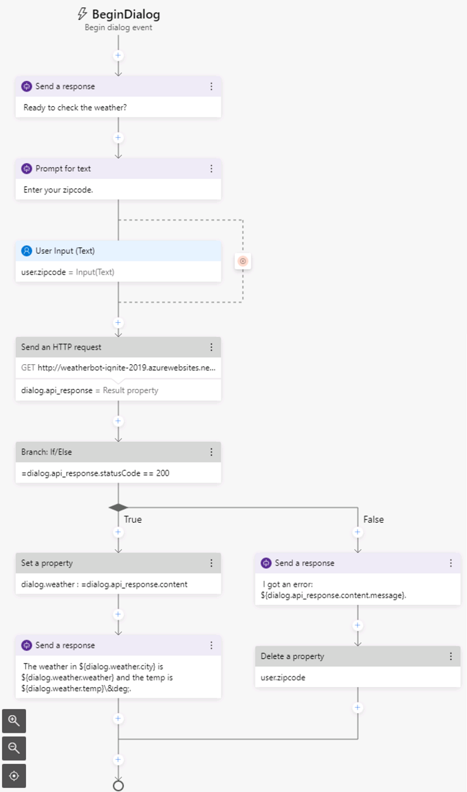

---
lab:
    title: 'Create a Bot with Bot Framework Composer'
    module: 'Module 7 - Conversational AI and the Azure Bot Service'
---

# Create a Bot with Bot Framework Composer

Bot Framework Composer is a graphical designer that lets you quickly and easily build sophisticated conversational bots without writing code. The composer is an open-source tool that presents a visual canvas for building bots.

## Get an OpenWeather API key

In this exercise, you will create a bot that retrieves the weather conditions for the zipcode entered by the user. You will require an API key for the service to work.

1. In a web browser, go to the OpenWeather site at `https://openweathermap.org/price`.
2. Request a free API key, and create an OpenWeather account (if you do not already have one).
3. After signing up, view the **API keys** page to see your API key.

## Create a bot

Now you're ready to use Composer to create a bot.

### Create a bot and customize the "welcome" dialog flow

1. Start the Bot Framework Composer.

    **Note**: The Bot Framework Composer is regularly updated. If you are prompted to install an update, do so for the currently logged in user. Updates may include changes to the user interface that affect the instructions in this exercise.

2. On the **Home** screen, select **New**. Then create a new bot from scratch; naming it **WeatherBot** and saving it in a local folder.
3. In the navigation pane on the left, select **Greeting** to open the authoring canvas and show the *ConversationUpdate* activity that is called when a user initially joins a conversation with the bot. The activity consists of a flow of actions.
4. In the properties pane on the right, edit the title of **Greeting** by selecting the word **Greeting** at the top of the properties pane on the right and changing it to **WelcomeUsers**.
5. In the authoring canvas, select the **Send a response** action. Then, in the properties pane, change the default text in the **Language Generation** box from *- ${WelcomeUser()}*  to `- Hi! I'm WeatherBot.` (including the preceding "-" dash).
6. In the authoring canvas, select the final **+** symbol (just above the circle that marks the <u>end</u> of the dialog flow), and add a new **Ask a question** action for a **Text** response.

    The new action creates two nodes in the dialog flow. The first node defines a prompt for the bot to ask the user a question, and the second node represents the response that will be received from the user. In the properties pane, these nodes have corresponding **Bot asks** and **User input** tabs.

7. In the properties pane, on the **Bot Asks** tab, set the **Prompt for text** value to `- What's your name?`. Then, on the **User Input** tab, set the **Property** value to `user.name` to define a variable that you can access later in the bot conversation.
8. Back in the authoring canvas, select the **+** symbol under the **User Input(Text)** action you just added, and add a **Send a response** action.
9. Select the newly added **Send a response** action and in the properties pane, set the **Language generation** value to `- Hello ${user.name}, nice to meet you!`.

    The completed activity flow should look like this:

    

### Test the bot

Your basic bot is complete so now let's test it.

1. Select **Start Bot** in the upper right-hand corner of Composer, and wait while your bot is compiled and started. This may take several minutes.

    - If a Windows Firewall message is displayed, enable access for all networks.

2. In the **Local bot runtime manager** pane, select **Test in Emulator**. Then wait for the Bot Framework Emulator to start.
3. In the Bot Framework Emulator, after a short pause, you will see the welcome message and the prompt to enter your first name.  Enter you first name and press **Enter**.
4. The bot should respond with the **Hello *your_name*, nice to meet you!**.
5. Close the emulator.
6. In Composer, in the **Local bot runtime manager** pane. use the ⏹ icon to stop the bot.

## Add a dialog to get the weather

Now that you have a working bot, you can expand its capabilities by adding dialogs for specific interactions. In this case, you'll add a dialog that is triggered when the user mentions "weather".

### Add a dialog

First, you need to define a dialog flow that will be used to handle questions about the weather.

1. In Composer, in the navigation pane, hold the mouse over the top level node (**WeatherBot**) and in the **&#8285;** menu, select **+ Add a dialog**, as shown here:

    

    Then create a new dialog named **getWeather** with the description **Get the current weather condition for the provided zip code**.
2. In the navigation pane, select the **BeginDialog** node for the new **getWeather** dialog. Then on the authoring canvas, use the **+** symbol to add a **Ask a question** action for a **Text** response.
3. In the properties pane, on the **Bot asks** tab, set the **Prompt for text** to `- Enter your zipcode.`.
4. On the **User Input** tab, set the **Property** field to `user.zipcode`, and set the **Output format** field to the expression `=trim(this.value)` to remove any superfluous spaces around the user-provided value.
5. On the **Other** tab, set the following values to define validation rules for the zipcode input:
    - In the **Recognizers** areas, set the **Unrecognized Prompt** field, to `- Sorry the value '${this.value}' doesn't appear to be a valid entry.  Please enter a zip code in the form of 12345.`.
    - In the **Validation** section, add the validation rule `length(this.value) == 5` to will check that the length of the zipcode entry is only five characters. Then set the **Invalid Prompt** field to `- Sorry, '${this.value}' is not valid. I'm looking for a 5-digit number as zip code. Please specify a zip code in the form 12345.`.
    - In the **Prompt configurations** section, set the **Default value** property to `98052`.

        By default, prompts are configured to ask the user for information *Max turn count* times (with a default of 3). When the max turn count is reached, the prompt will stop and the property will be set to the value defined in the **Default value** field before moving forward with the conversation.

    The activity flow so far should look like this:

    

    So far, the dialog asks the user to enter a zip code, and validates the user input. Now you must implement the logic to retrieve the weather information for the zip code that was entered.

6. On the authoring canvas, directly under the **user Input** action for the user zip code entry, select the **+** symbol to add a new action.
7. From the list of actions, select **Access external resources** and then **Send an HTTP request**.
8. Set the properties for the **HTTP request** as follows, replacing **YOUR_API_KEY** with your [OpenWeather](https://openweathermap.org/price) API key:
    - **HTTP method**: GET
    - **Url**: `http://weatherbot-ignite-2019.azurewebsites.net/api/getWeather?zipcode=${user.zipcode}&api_token=YOUR_API_KEY`
    - **Result property**: `dialog.api_response`

    The result can include any of the following four properties from the HTTP response:

    - **statusCode**. Accessed via **dialog.api_response.statusCode**.
    - **reasonPhrase**. Accessed via **dialog.api_response.reasonPhrase**.
    - **content**. Accessed via **dialog.api_response**.content.
    - **headers**. Accessed via **dialog.api_response.headers**.

    Additionally, if the response type is JSON, it will be a deserialized object available via **dialog.api_response.content** property.

    Now you need to add logic to the dialog flow that handles the response, which might indicate success or failure of the HTTP request.

9. On the authoring canvas, under the **Send HTTP Request** action you created, add a **Create a condition** > **Branch: if/else** action. This action defines a branch in the dialog flow with **True** and **False** paths.
10. In the **Properties** of the branch action, set the **Condition** field to write the following expression:

    ```
    =dialog.api_response.statusCode == 200
    ```

11. If the call was successful, you need to store the response in a variable. On the authoring canvas, in the **True** branch, add a **Manage properties** > **Set a Property** action. Then in the properties pane, set the properties of the **Set a Property** action as follows:
    - **Property**: `dialog.weather`
    - **Value**: `=dialog.api_response.content`

12. Still in the **True** branch, add a **Send a response** action under the **Set a property** action and set its **Language generation** text to:

    ```
    - The weather in ${dialog.weather.city} is ${dialog.weather.weather} and the temp is ${dialog.weather.temp}&deg;.
    ```

13. You also need to account for a response from the weather service that is not 200, so in the **False** branch, add a **Send a response** action and set its **Language generation** text to `- I got an error: ${dialog.api_response.content.message}.`

    The dialog flow should now look like this:

    


14. Finally, you need to reset the zip code variable so that the user can enter an alternative location the next time they check the weather. After the **If/Else** branch, select the last **+** symbol, add a **Manage properties** > **Delete a property** action and set its **Property** field to `user.zipcode`.

    The finished activity flow should look like the following image:

    

### Add a trigger for the dialog

Now you need some way for the new dialog to be initiated from the existing welcome dialog.

1. In the navigation pane, select the **WeatherBot** dialog that contains **WelcomeUsers** (this is under the top-level bot node of the same name).

    

2. In the properties pane for the selected **WeatherBot** dialog, in the **Language Understanding** section, set the **Recognizer type** to **Regular expression recognizer**.

    > The default recognizer type uses the Language Understanding service to product the user's intent using a natural language understanding model. We're using a regular expression recognizer to simplify this exercise. In a real, application, you should consider using Language Understanding to allow for more sophisticated intent recognition.

3. In the **&#8285;** menu for the **WeatherBot** dialog, select **Add a Trigger**.

    

    Then create a trigger with the following settings:

    - **What is the type of this trigger?**: Intent recognized
    - **What is the name of this trigger (RegEx)**:  `WeatherRequested`
    - **Please input regex pattern**: `weather`

    > The text entered in the regex pattern text box is a simple regular expression pattern that will cause the bot to look for the word *weather* in any incoming message.  If "weather" is present, the message becomes a **recognized intent** and the trigger is initiated. 

4. Now that the trigger is created, you need to configure an action for it. In the authoring canvas for the trigger, select the **+** symbol under your new **WeatherRequested** trigger node. Then in the list of actions, select **Dialog Management** and select **Begin a new dialog**.
5. With the **Begin a new dialog** action selected, in the properties pane, select the **getWeather** dialog from the **Dialog name** drop-down list to start the **getWeather** dialog you defined earlier when the **WeatherRequested** trigger is recognized.

    The **WeatherRequested** activity flow should look like this:

    

6. Restart the bot and test it in the Bot Framework Emulator. Wait for the greeting from the bot and after entering your name, enter `What is the weather like?`. Then, when prompted, enter a valid U.S. zip code, such as `98004`. The bot will contact the service and should respond with a small weather report statement.
7. When you have finished testing, close the emulator and stop the bot.

## Handle interruptions

A well designed bot should allow users to change the flow of the conversation, for example by canceling a request.

1. In the Bot Composer, in the navigation pane, use the **&#8285;** menu for the **WeatherBot** dialog to add a new trigger (in addition to the existing **WelcomeUsers** and **WeatherRequested** triggers). The new trigger should have the following settings:

    - **What is the type of this trigger?**: Intent recognized
    - **What is the name of this trigger (RegEx)**:  `CancelRequest`
    - **Please input regex pattern**: `cancel`

    > The text entered in the regex pattern text box is a simple regular expression pattern that will cause the bot to look for the word *cancel* in any incoming message.

2. In the authoring canvas for the trigger, add a **Send a response** action, and set its **Language Generation** property to `- OK. Whenever you're ready, you can ask me about the weather.`
3. Under the **Send a response** action, add a new action to and the dialog by selecting **Dialog management** and **End this dialog**.

    The **CancelRequest** dialog flow should look like this:

    

    Now that you have a trigger to respond to a user's request to cancel, you must allow interruptions to dialog flows where the user might want to make such a request - such as when prompted for a zip code after asking for weather information.

4. In the navigation pane, select **BeginDialog** under the **getWeather** dialog.
5. Select the **Prompt for text** action that asks the user to enter their zip code.
6. In the properties for the action, on the **Other** tab, expand **Prompt Configurations** and set the **Allow Interruptions** property to **True**.
7. Restart the bot and test it in the Bot Framework Emulator. Wait for the greeting from the bot and after entering your name, enter "What is the weather like?". Then, when prompted, enter `cancel`, and confirm that the request is canceled.
8. After canceling the request, enter `What's the weather like?` and note that the appropriate trigger starts a new instance of the **getWeather** dialog, prompting you once again to enter a zip code.
9. When you have finished testing, close the emulator and stop the bot.

## Enhance the user experience

The interactions with the weather bot so far has been through text.  Users enter text for their intentions and the bot responds with text. While text is often a suitable way to communicate, you can enhance the experience through other forms of user interface element.  For example, you can use buttons to initiate recommended actions, or display a *card* to present information visually.

### Add a button

1. In the Bot Framework Composer, in the navigation pane, under the **getWeather** action, select **BeginDialog**.
2. In the authoring canvas, select the **Prompt for text** action that contains the prompt for the zip code.
3. In the properties pane, update **Prompt for text** with the following value (Ensure that you remove the **-** dash along with the existing text).

```
[Activity
    Text = What is your zip code?
    SuggestedActions = Cancel
]
```

This activity will prompt the user for their zip code as before, but also display a **Cancel** button.

### Add a card

1. In the **getWeather** dialog, in the **True** path after checking the response from the HTTP weather service, select the **Send a response** action that displays the weather report, and replace the existing **Language Generation** template with this code.

```
[ThumbnailCard
    title = Weather for ${dialog.weather.city}
    text = ${dialog.weather.weather} (${dialog.weather.temp}&deg;)
    image = ${dialog.weather.icon}
]
```

This template will use the same variables as before for the weather condition but also adds a title to the card that will be displayed, along with an image for the weather condition.

### Test the new user interface

1. Restart the bot and test it in the Bot Framework Emulator. Wait for the greeting from the bot and after entering your name, enter "What is the weather like?". Then, when prompted, click the **Cancel** button to cancel the request.
2. After canceling, enter enter `Tell me about the weather` and when prompted, enter a valid U.S. zip code, such as `98004`. The bot will contact the service and should respond with a card indicating the weather conditions.
3. When you have finished testing, close the emulator and stop the bot.

## More information

To learn more about Bot Framework Composer, view the [Bot Framework Composer documentation](https://docs.microsoft.com/composer/introduction).
