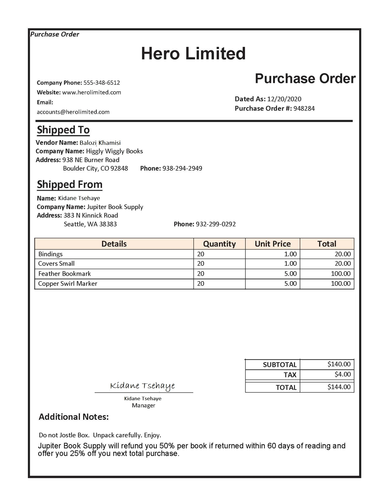
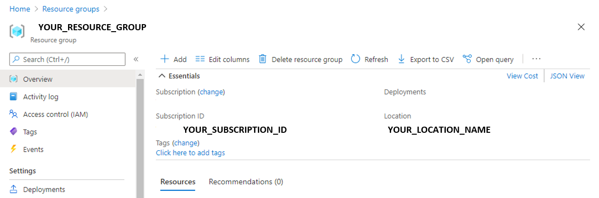

---
lab:
    title: 'Extract Data from Forms'
    module: 'Module 11 - Reading Text in Images and Documents'
---

# Extract Data from Forms 

Suppose a company needs to automate a data entry process. Currently an employee might manually read a purchase order and enter the data into a database. You want to build a model that will use machine learning  to read the form and produce structured data that can be used to automatically update a database.

**Form Recognizer** is a cognitive service that enables users to build automated data processing software. This software can extract text, key/value pairs, and tables from form documents using optical character recognition (OCR). Form Recognizer has pre-built models for recognizing invoices, receipts, and business cards. The service also provides the capability to train custom models. In this exercise, we will focus on building custom models.

## Clone the repository for this course

If you have not already done so, you must clone the code repository for this course:

1. Start Visual Studio Code.
2. Open the palette (SHIFT+CTRL+P) and run a **Git: Clone** command to clone the `https://github.com/MicrosoftLearning/AI-102-AIEngineer` repository to a local folder (it doesn't matter which folder).
3. When the repository has been cloned, open the folder in Visual Studio Code.
4. Wait while additional files are installed to support the C# code projects in the repo.

    > **Note**: If you are prompted to add required assets to build and debug, select **Not Now**.

## Create a Form Recognizer resource

To use the Form Recognizer service, you need a Form Recognizer resource in your Azure subscription. You'll use the Azure portal to create a resource.

1.  Open the Azure portal at `https://portal.azure.com`, and sign in using the Microsoft account associated with your Azure subscription.

2. Select the **&#65291;Create a resource** button, search for *Form Recognizer*, and create a **Form Recognizer** resource with the following settings:
    - **Subscription**: *Your Azure subscription*
    - **Resource group**: *Choose or create a resource group (if you are using a restricted subscription, you may not have permission to create a new resource group - use the one provided)*
    - **Region**: *Choose any available region*
    - **Name**: *Enter a unique name*
    - **Pricing tier**: F0

    > **Note**: If you already have an F0 form recognizer service in your subscription, select **S0** for this one.

3. When the resource has been deployed, go to it and view its **Keys and Endpoint** page. You will need the **endpoint** and one of the **keys** from this page to manage access from your code later on. 

## Gather documents for training

  

You'll use the sample forms from the **21-custom-form/sample-forms** folder in this repo, which contain all the files you'll need to train a model without labels and another model with labels.

1. In Visual Studio Code, in the **21-custom-form** folder,  expand the **sample-forms** folder. Notice there are files ending in **.json** and **.jpg** in the folder.

    You will use the **.jpg** files to train your first model _without_ labels.  

    Later, you will use the files ending in **.json** and **.jpg** to train your second model _with_ labels. The **.json** files have been generated for you and contain label information. To train with labels, you need to have the label information files in your blob storage container alongside the forms. 

2. Return to the Azure portal at [https://portal.azure.com](https://portal.azure.com).

3. View the **Resource group** in which you created the Form Recognizer resource previously.

4. On the **Overview** page for your resource group, note the **Subscription ID** and **Location**. You will need these values, along with your **resource group** name in subsequent steps.



5. In Visual Studio Code, in the Explorer pane, right-click the the **21-custom-form** folder and select **Open in Integrated Terminal**.

6. In the terminal pane, enter the following command to establish an authenticated connection to your Azure subscription.
    
```
az login --output none
```

7. When prompted, sign into your Azure subscription. Then return to Visual Studio Code and wait for the sign-in process to complete.

8. Run the following command to list Azure locations.

```
az account list-locations -o table
```

9. In the output, find the **Name** value that corresponds with the location of your resource group (for example, for *East US* the corresponding name is *eastus*).

    > **Important**: Record the **Name** value and use it in Step 12.

10. In the Explorer pane, in the **21-custom-form** folder, select **setup.cmd**. You will use this batch script to run the Azure command line interface (CLI) commands required to create the other Azure resources you need.

11. In the **setup.cmd** script, review the **rem** commands. These comments outline the program the script will run. The program will: 
    - Create a storage account in your Azure resource group
    - Upload files from your local _sampleforms_ folder to a container called _sampleforms_ in the storage account
    - Print a Shared Access Signature URI

12. Modify the **subscription_id**, **resource_group**, and **location** variable declarations with the appropriate values for the subscription, resource group, and location name where you deployed the Form Recognizer resource. 
Then **save** your changes.

    Leave the **expiry_date** variable as it is for the exercise. This variable is used when generating the Shared Access Signature (SAS) URI. In practice, you will want to set an appropriate expiry date for your SAS. You can learn more about SAS [here](https://docs.microsoft.com/azure/storage/common/storage-sas-overview#how-a-shared-access-signature-works).  

13. In the terminal for the **21-custom-form** folder, enter the following command to run the script:

```
setup
```

14. When the script completes, review the displayed output and note your Azure resource's SAS URI.

> **Important**: Before moving on, paste the SAS URI somewhere you will be able to retrieve it again later (for example, in a new text file in Visual Studio Code).

15. In the Azure portal, refresh the resource group and verify that it contains the Azure Storage account just created. Open the storage account and in the pane on the left, select **Storage Browser (preview)**. Then in Storage Browser, expand **BLOB CONTAINERS** and select the **sampleforms** container to verify that the files have been uploaded from your local **21-custom-form/sample-forms** folder.

## Train a model *without* labels

You will use the Form Recognizer SDK to train and test a custom model.  

> **Note**: In this exercise, you can choose to use the API from either the **C#** or **Python** SDK. In the steps below, perform the actions appropriate for your preferred language.

1. In Visual Studio Code, in the **21-custom-form** folder, expand the **C-Sharp** or **Python** folder depending on your language preference.
2. Right-click the **train-model** folder and open an integrated terminal.

3. Install the Form Recognizer package by running the appropriate command for your language preference:

**C#**

```
dotnet add package Azure.AI.FormRecognizer --version 3.0.0 
```

**Python**

```
pip install azure-ai-formrecognizer==3.0.0
```

3. View the contents of the **train-model** folder, and note that it contains a file for configuration settings:
    - **C#**: appsettings.json
    - **Python**: .env

4. Edit the configuration file, modifying the settings to reflect:
    - The **endpoint** for your Form Recognizer resource.
    - A **key** for your Form Recognizer resource.
    - The **SAS URI** for your blob container.

5. Note that the **train-model** folder contains a code file for the client application:

    - **C#**: Program.cs
    - **Python**: train-model.py

    Open the code file and review the code it contains, noting the following details:
    - Namespaces from the package you installed are imported
    - The **Main** function retrieves the configuration settings, and uses the key and endpoint to create an authenticated **Client**.
    - The code uses the the training client to train a model using the images in your blob storage container, which is acessed using the SAS URI you generated.
    - Training is performed with a parameter to indicate that training labels should <u>not</u> be used. Form Recognizer uses an *unsupervised* technique to extract the fields from the form images.

6. Return the integrated terminal for the **train-model** folder, and enter the following command to run the program:

**C#**

```
dotnet run
```

**Python**

```
python train-model.py
```

7. Wait for the program to end. Then review the model output and locate the Model ID in the terminal. You will need this value in the next procedure, so do not close the terminal!

## Test the model created without labels

Now you're ready use your trained model. Notice how you trained your model using files from a storage container URI. You could also have trained the model using local files. Similarly, you can test your model using forms from a URI or from local files. You will test the form model with a local file.

Now that you've got the model ID, you can use it from a client application. Once again, you can choose to use **C#** or **Python**.

1. In the **21-custom-form** folder, in the subfolder for your preferred language (**C-Sharp** or **Python**), expand the **test-model** folder.
2. Right-click the **test-model** folder and open an integrated terminal. You now have (at least) two **cmd** terminals, and you can switch between them using the drop-down list in the Terminal pane.
3. In the terminal for the **test-model** folder, install the Form Recognizer package by running the appropriate command for your language preference:

**C#**

```
dotnet add package Azure.AI.FormRecognizer --version 3.0.0 
```

**Python**

```
pip install azure-ai-formrecognizer==3.0.0
```

*This isn't strictly necessary if you previously used pip to install the package into Python environment; but it does no harm to ensure it's installed!*

4. In the **test-model** folder, edit the configuration file (**appsettings.json** or **.env**, depending on your language preference) to add the following values:
    - Your Form Recognizer endpoint.
    - Your Form Recognizer key.
    - The Model ID generated when you trained the model (you can find this by switching the terminal back to the **cmd** console for the **train-model** folder).

5. In the **test-model** folder, open the code file for your client application (*Program.cs* for C#, *test-model.py* for Python) and review the code it contains, noting the following details:
    - Namespaces from the package you installed are imported
    - The **Main** function retrieves the configuration settings, and uses the key and endpoint to create an authenticated **Client**.
    - The client is then used to extract form fields and values from the **test1.jpg** image.
    
6. Return the integrated terminal for the **test-model** folder, and enter the following command to run the program:

**C#**

```
dotnet run
```

**Python**

```
python test-model.py
```

7. View the output and notice the prediction confidence scores. Notice how the output provides field names field-1, field-2 etc. 

## Train a model *with* labels using the client library

Suppose after you trained a model with the invoice forms, you wanted to see how a model trained on labeled data performs. When you trained a model without labels you only used the **.jpg** forms from your Azure blob container. Now you will train a model using the **.jpg** and **.json** files.

1. In Visual Studio Code, in the **21-custom-form/sample-forms** folder, open **fields.json** and review the JSON document it contains. This file defines the fields that you will train a model to extract from the forms.
2. Open **Form_1.jpg.labels.json** and review the JSON it contains. This file identifies the location and values for named fields in the **Form_1.jpg** training document.
3. Open **Form_1.jpg.ocr.json** and review the JSON it contains. This file contains a JSOn representation of the text layout of **Form_1.jpg**, including the location of all text areas found in the form.

    *The field information files have been provided for you in this exercise. For your own projects, you can create these files using the [sample labeling tool](https://docs.microsoft.com/azure/cognitive-services/form-recognizer/label-tool). As you use the tool, your field information files are automatically created and stored in your connected storage account.*

4. In the **train-model** folder, open the code file for the training application:

    - **C#**: Program.cs
    - **Python**: train-model.py

5. In the **Main** function, find the comment **Train model**, and modify it as shown to change the training process so that labels are used:

**C#**

```C#
// Train model 
CustomFormModel model = await trainingClient
.StartTrainingAsync(new Uri(trainingStorageUri), useTrainingLabels: true)
.WaitForCompletionAsync();
```

**Python**

```Python
# Train model 
poller = form_training_client.begin_training(trainingDataUrl, use_training_labels=True)
model = poller.result()
```

6. Return the integrated terminal for the **train-model** folder, and enter the following command to run the program:

**C#**

```
dotnet run
```

**Python**

```
python train-model.py
```

10. Wait for the program to end, then review the model output.
11. Note the new the Model ID in the terminal output. 

## Test the model created with labels

1. In the **test-model** folder, edit the configuration file (**appsettings.json** or **.env**, depending on your language preference) and update it to reflect the new model ID. Save your changes.
2. Return the integrated terminal for the **test-model** folder, and enter the following command to run the program:

**C#**

```
dotnet run
```

**Python**

```
python test-model.py
```
    
3. View the output and observe how the output for the model trained **with** labels provides field names like "CompanyPhoneNumber" and "DatedAs" unlike the output from the model trained **without** labels, which produced an output of field-1, field-2 etc.  

While the program code for training a model _with_ labels may not differ greatly from the code for training _without_ labels, choosing one versus the other _does_ change project planning needs. To train with labels, you will need to [create the labeled files](https://docs.microsoft.com/azure/cognitive-services/form-recognizer/quickstarts/label-tool?tabs=v2-0). The choice of training process can also produce different models, which can in turn affect downstream processes based on what fields the model returns and how confident you are with the returned values. 

## More information

For more information about the Form Recognizer service, see the [Form Recognizer documentation](https://docs.microsoft.com/azure/cognitive-services/form-recognizer/).
